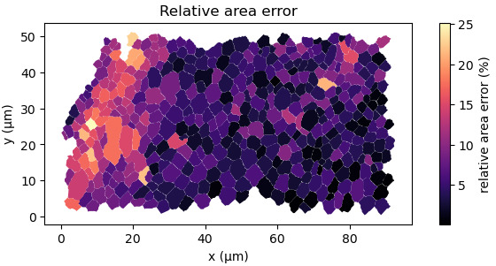
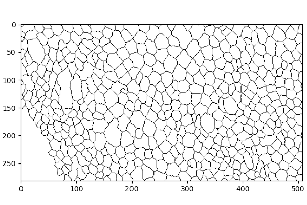
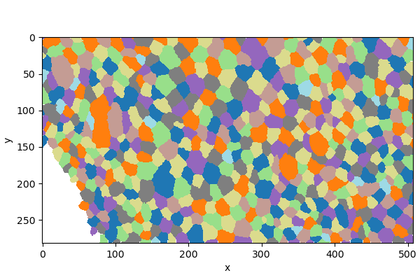

# DeProjPy

`deprojpy` is a Python implementation of the core [matlab project DeProj](https://gitlab.pasteur.fr/iah-public/DeProj) workflow: deproject segmented epithelial cell contours onto a height-map surface, compute 3D cell geometry, and estimate distances on the deprojected surface.


The goal is not GUI parity with MATLAB. The focus is a scriptable Python API for deprojection, feature measurement, plotting, and surface-distance calculations.

## Installation

Install directly from GitHub:

```bash
python -m pip install git+https://github.com/mwappner/deprojpy.git
```

For development, clone the repository and install it in editable mode:

```bash
git clone https://github.com/mwappner/deprojpy.git
cd deprojpy
python -m pip install -e ".[test]"
python -m pytest
```

The label-image workflow requires the companion `labelimage-tools` package:

```bash
python -m pip install git+https://github.com/mwappner/labelimage-tools.git
```

## Quick start: DeProj-style mask input

The MATLAB-style workflow starts from a binary-like segmentation mask and a height map. In the mask image, cell interiors are non-zero and cell borders are zero-valued ridges.

```python
import deprojpy as dp

mask, heightmap = dp.load_tiff_pair("samples/Segmentation-2.tif", "samples/HeightMap-2.tif")
result = dp.from_heightmap(mask, heightmap,
    pixel_size=0.183, voxel_depth=1.0, units="µm",
    invert_z=True, inpaint_zeros=True, prune_zeros=True)

df = result.to_dataframe()
result.to_csv("measurements.csv")
```

Returned boundaries, centers, and junction centroids use geometric `(x, y, z)` order in physical units. Input images still use normal image indexing `(row, column)`.

Plot a scalar feature on the deprojected cell polygons:

```python
fig, ax = dp.plotting.plot_feature_map(result, "area")
fig, ax = dp.plotting.plot_heightmap_with_centers(heightmap, result)
```

<p align="center">
  
</p>
<p align="center">
  
</p>

## Why deproject?

Measurements made directly on the 2D segmentation image can underestimate cell
geometry when the tissue surface is curved or tilted. DeProjPy measures cell
contours after lifting them onto the height-map surface, so quantities such as
area and perimeter are reported in surface-corrected physical units.

A useful diagnostic is the relative area difference between the deprojected
surface area and the original projected 2D area:

```python
fig, ax = dp.plotting.plot_relative_error_map(result, 'area')
```

<p align="center">
  
</p>

Positive values indicate cells whose surface-corrected area is larger than their
projected 2D area. This is the geometric correction DeProj is designed to make
visible and measurable.

## Alternative input: labeled segmentations

DeProjPy is modernized compared to the Matlab version, as it can also start from an integer label image, where each cell has a unique label and background is zero. This is useful for outputs from segmentation pipelines that already return labels rather than DeProj-style ridge masks, such as [FishFeats](https://gletort.github.io/FishFeats/).

| DeProj-style mask | Label image |
|---|---|
| `from_heightmap(mask, heightmap, ...)` | `from_labels(labels, heightmap, ...)` |
| Cell interiors are non-zero; borders are zero. | Each cell has a unique integer label; background is zero. |

<p align="center">
  
  
</p>

```python
import deprojpy as dp

labels, heightmap = dp.load_label_heightmap_pair("samples/Labels-2.tif", "samples/HeightMap-2.tif")
result = dp.from_labels(labels, heightmap,
    pixel_size=0.183, voxel_depth=1.0, units="µm",
    invert_z=True, inpaint_zeros=True, prune_zeros=True)

df = result.to_dataframe()
```

The label workflow returns the same kind of `DeprojResult` as the mask workflow. Original label IDs are preserved as `source_label` when available.

## Surface distances

DeProjPy introduces new reusable tools for distances constrained to a surface.

There are two main distance ideas:

- **straight surface distance**: sample the surface along the straight segment in
  `xy` and measure the lifted 3D polyline;
- **graph geodesic distance**: build a sparse surface graph and compute shortest
  paths on the graph. This is an approximation to the continuous geodesic.

For plotting paths on the fitted DeProj cell-contour surface, build the calculator from cell boundaries:

```python
import numpy as np
from deprojpy.surface_distance import SurfaceDistanceCalculator, SurfaceGraph

centers = df[["center_x", "center_y"]].to_numpy()

calc = SurfaceDistanceCalculator.from_cell_boundaries(result)
d_straight = calc.straight_distance(centers[10], centers[200], input_units="physical")

graph = SurfaceGraph.from_calculator(calc, step="auto", connectivity="16")
d_graph, path_px = graph.distance(centers[10], centers[200],
    input_units="physical", return_path=True)
```

For all-pairs straight surface distances between cell centers:

```python
D = calc.straight_pairwise_distances(centers, input_units="physical")
```

Graph paths are returned in pixel coordinates, matching graph nodes. To plot them in 3D, sample the calculator surface and convert xy back to physical units:

```python
path_z = calc.sample_height(path_px, input_units="pixel")
path_xyz = np.column_stack([path_px * result.pixel_size, path_z])
```

<p align="center">
  
</p>

Use `SurfaceDistanceCalculator.from_result(...)` when you want distances on the prepared height-map surface. Use `SurfaceDistanceCalculator.from_cell_boundaries(...)` when you want paths and distances on the fitted surface represented by the deprojected cell contours.

## What is in a result?

A `DeprojResult` contains:

- `result.epicells`: one `EpiCell` per retained cell;
- `result.to_dataframe()`: a tabular summary of cell features;
- `result.prepared_heightmap`: the height map used for deprojection;
- deprojected boundaries, centers, junctions, and geometry in physical units.

The most common workflow is:

```python
result = dp.from_heightmap(mask, heightmap, ...)
df = result.to_dataframe()
```

or:

```python
result = dp.from_labels(labels, heightmap, ...)
df = result.to_dataframe()
```

## More examples

See [`docs/cookbook.md`](docs/cookbook.md) and the scripts in [`examples/`](examples/) for copy-pastable workflows covering plotting, diagnostics, label inputs, exports, curvature maps, and surface distances.

## Validation status

The Python implementation is tested with synthetic invariants and the original DeProj sample images. It is not yet certified against MATLAB golden outputs.

With the original sample files, expected smoke-check values include:

- image shape `(282, 508)`;
- 426 retained cells;
- finite positive cell areas and perimeters.

## License

This repository is currently intended for internal research use. Add or update a
license file before external redistribution.
