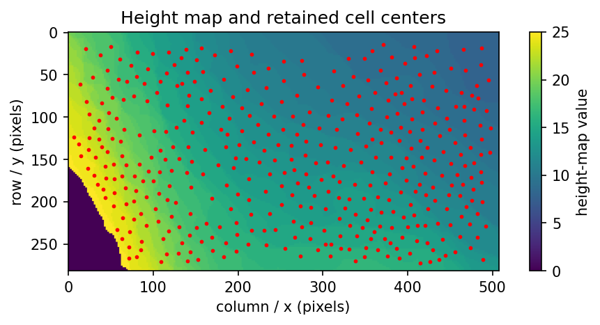
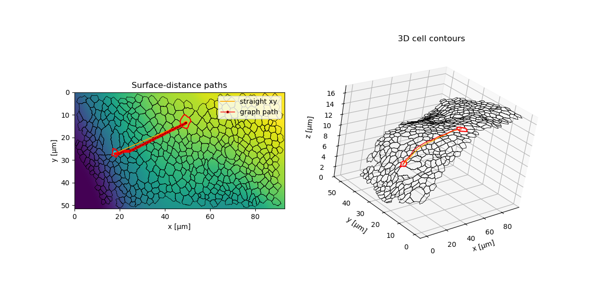

# DeProjPy cookbook

This cookbook collects short copy-pastable recipes for common DeProjPy workflows.
The README shows the main story; this file is meant as a practical reference when
you want to adapt one piece of the workflow.

Most recipes assume the repository sample files:

```text
samples/Segmentation-2.tif
samples/HeightMap-2.tif
samples/Labels-2.tif
```

and the same physical calibration used in the examples:

```python
PIXEL_SIZE = 0.183
VOXEL_DEPTH = 1.0
UNITS = "µm"
INVERT_Z = True
```

## 1. Load data

### Mask + height map

Use this when your segmentation is a DeProj-style mask: cell interiors are
non-zero and cell borders/ridges are zero.

```python
import deprojpy as dp

mask, heightmap = dp.load_tiff_pair(
    "samples/Segmentation-2.tif",
    "samples/HeightMap-2.tif",
)
```

### Labels + height map

Use this when your segmentation is an integer label image: each cell has a unique
label and background is zero. This workflow requires `labelimage-tools`.

```python
import deprojpy as dp

labels, heightmap = dp.load_label_heightmap_pair(
    "samples/Labels-2.tif",
    "samples/HeightMap-2.tif",
)
```

## 2. Run deprojection

### Deproject a mask

```python
result = dp.from_heightmap(mask, heightmap,
    pixel_size=PIXEL_SIZE, voxel_depth=VOXEL_DEPTH, units=UNITS,
    invert_z=INVERT_Z, inpaint_zeros=True, prune_zeros=True)
```

### Deproject labels

```python
result = dp.from_labels(labels, heightmap,
    pixel_size=PIXEL_SIZE, voxel_depth=VOXEL_DEPTH, units=UNITS,
    invert_z=INVERT_Z, inpaint_zeros=True, prune_zeros=True)
```

### Keep border cells in a label workflow

Border cells are commonly dropped in quantitative workflows, but sometimes it is
useful to keep them for visual diagnostics.

```python
result = dp.from_labels(labels, heightmap,
    pixel_size=PIXEL_SIZE, voxel_depth=VOXEL_DEPTH, units=UNITS,
    invert_z=INVERT_Z, drop_border_cells=False)
```

## 3. Export measurements

Convert the result to a `pandas.DataFrame` or write it directly to CSV.

```python
df = result.to_dataframe()
result.to_csv("measurements.csv")
```

The result uses geometric coordinates in physical units. For example,
`cell.center` is `(x, y, z)`, not `(row, column, z)`.

```python
centers_xyz = df[["center_x", "center_y", "center_z"]].to_numpy()
```

## 4. Plot basic diagnostics

### Show detected mask objects

```python
fig, ax = dp.plotting.plot_mask_objects(mask)
```

<p align="center">
  
</p>

### Show the height map with cell centers

```python
fig, ax = dp.plotting.plot_heightmap_with_centers(result)
```

<p align="center">
  
</p>

### Plot 3D boundaries

```python
fig, ax = dp.plotting.plot_3d_boundaries(result, "area")
ax.view_init(azim=115, elev=1)
```

<p align="center">
  
</p>

## 5. Plot cell features

### Area map

```python
fig, ax = dp.plotting.plot_feature_map(result, "area", cmap="viridis")
```

<p align="center">
  
</p>

### Neighbor count map

```python
fig, ax = dp.plotting.plot_feature_map(result, "n_neighbors",
    cmap="tab10", edgecolor="k", linewidth=0.4)
```

<p align="center">
  
</p>

### Multiple feature maps

```python
import matplotlib.pyplot as plt

fig, axes = plt.subplots(1, 2, figsize=(9, 4))
dp.plotting.plot_feature_map(result, "eccentricity", ax=axes[0],
    title="Eccentricity", edgecolor="white", linewidth=0.1)
dp.plotting.plot_feature_map(result, "n_neighbors", ax=axes[1],
    title="Neighbor count", cmap="tab10", edgecolor="k", linewidth=0.4)
```

<p align="center">
  
</p>

### Feature histograms

```python
fig, axes = dp.plotting.plot_feature_histograms(result,
    features=("area", "perimeter", "eccentricity", "n_neighbors"))
```

<p align="center">
  
</p>

## 6. Plot deprojection corrections

A useful sanity check is to compare deprojected measurements to their projected
2D counterparts. Large values indicate regions where 2D measurements would miss
surface geometry.

```python
fig, axes = plt.subplots(2, 2, figsize=(10, 8), layout="constrained")
dp.plotting.plot_feature_map(result, "area_error", ax=axes[0, 0],
    title="Absolute area error")
dp.plotting.plot_feature_map(result, "perimeter_error", ax=axes[0, 1],
    title="Absolute perimeter error")
dp.plotting.plot_relative_error_map(result, "area", ax=axes[1, 0],
    title="Relative area error")
dp.plotting.plot_relative_error_map(result, "perimeter", ax=axes[1, 1],
    title="Relative perimeter error")
```

<p align="center">
  
</p>

## 7. Surface distances

DeProjPy supports two surface-distance ideas:

- **straight surface distance**: draw a straight segment in xy, lift it onto the
  surface, and measure the 3D polyline length;
- **graph geodesic distance**: build a sparse surface graph and compute shortest
  paths on that graph. This is an approximation to the continuous geodesic.

### Build calculators

Use `from_result(...)` for the prepared height-map surface.

```python
from deprojpy.surface_distance import SurfaceDistanceCalculator, SurfaceGraph

heightmap_calc = SurfaceDistanceCalculator.from_result(result, heightmap,
    prepared=False, invert_z=INVERT_Z, inpaint_zeros=True, prune_zeros=True)
```

Use `from_cell_boundaries(...)` for the fitted surface represented by the
deprojected cell contours. This is usually the better choice for plotting paths
over deprojected boundaries.

```python
boundary_calc = SurfaceDistanceCalculator.from_cell_boundaries(result,
    method="linear", extrapolation="nearest")
```

### Distance between two cells

```python
import numpy as np

centers_phys = np.asarray([cell.center[:2] for cell in result.epicells])
i, j = 10, 200

d_straight = boundary_calc.straight_distance(
    centers_phys[i], centers_phys[j], input_units="physical")
```

### Graph-geodesic path

```python
graph = SurfaceGraph.from_calculator(boundary_calc,
    step="auto", target_nodes=80_000, connectivity="16")

d_graph, path_px = graph.distance(centers_phys[i], centers_phys[j],
    input_units="physical", return_path=True)
```

Graph paths are returned in pixel coordinates. To plot them in 3D, sample the
calculator surface and convert xy back to physical units.

```python
path_z = boundary_calc.sample_height(path_px, input_units="pixel")
path_xyz = np.column_stack([path_px * result.pixel_size, path_z])
```

<p align="center">
  
</p>

### All-pairs straight surface distances

The straight-distance calculator has an optimized all-pairs path.

```python
D = boundary_calc.straight_pairwise_distances(
    centers_phys, input_units="physical")
```

`D[i, j]` is the straight surface distance between cells `i` and `j`, in
physical units.

## 8. Curvature and array-valued features

Some cell features are stored as scalar components of array-valued attributes.
For curvature maps, use the scalar feature names exposed by the plotting module.

```python
fig, ax = dp.plotting.plot_feature_map(result, "curvature_mean",
    cmap="coolwarm")
```

Other useful names include:

```text
curvature_mean
curvature_gaussian
curvature_k1
curvature_k2
```

For signed quantities such as curvature, it is often useful to pass a divergent
normalization.

```python
from matplotlib.colors import CenteredNorm

fig, ax = dp.plotting.plot_feature_map(result, "curvature_mean",
    cmap="coolwarm", norm=CenteredNorm(vcenter=0))
```

## 9. Compare mask and label workflows

If you generate labels from the same mask, the two workflows should give similar
results, but cell order and label IDs may differ. Match cells by center position,
then compare features.

```python
from scipy.spatial import KDTree
import numpy as np

centers_a = np.asarray([cell.center for cell in result_mask.epicells])
centers_b = np.asarray([cell.center for cell in result_labels.epicells])

dist, idx_b = KDTree(centers_b).query(centers_a)
area_a = np.asarray([cell.area for cell in result_mask.epicells])
area_b = np.asarray([result_labels.epicells[j].area for j in idx_b])

relative_difference = np.abs(area_b - area_a) / area_a
```

Then plot the mismatch on one of the geometries:

<p align="center">
  
</p>

## 10. Troubleshooting

### The z-axis looks inverted

Check that the same `invert_z` convention was used to create the result and any
surface-distance calculator derived from the raw height map.

```python
print(np.nanmin(result.prepared_heightmap), np.nanmax(result.prepared_heightmap))
print(np.nanmin(calc.heightmap), np.nanmax(calc.heightmap))
```

If you want the calculator to follow exactly the deprojected result surface, use:

```python
calc = SurfaceDistanceCalculator.from_result(result)
```

or, for the fitted cell-boundary surface:

```python
calc = SurfaceDistanceCalculator.from_cell_boundaries(result)
```

### Graph paths look jagged or digital

That is expected for graph geodesics. Even with `step=1`, the path is restricted
to a finite set of graph-edge directions. Use graph distances as approximate
geodesics, not as smooth continuous paths.

For smoother visualization, plot the path returned by the graph, then resample or
smooth it for display only.

### Distances seem too small or too large

Check input coordinate units. Most point-input methods accept:

```python
input_units="pixel"
input_units="physical"
```

Returned distances are always in physical units.

### Label workflow fails to import

Install the companion package:

```bash
python -m pip install git+https://github.com/mwappner/labelimage-tools.git
```

## 11. Run the example scripts

From the repository root:

```bash
python examples/01_run_sample.py
python examples/02_plot_gallery.py
python examples/03_run_labeled_sample.py
python examples/04_label_plots.py
python examples/05_surface_distances.py
```

Generated plots are written under:

```text
examples/output/plots/
```
