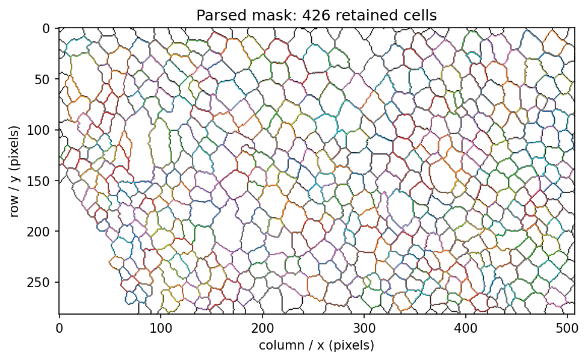
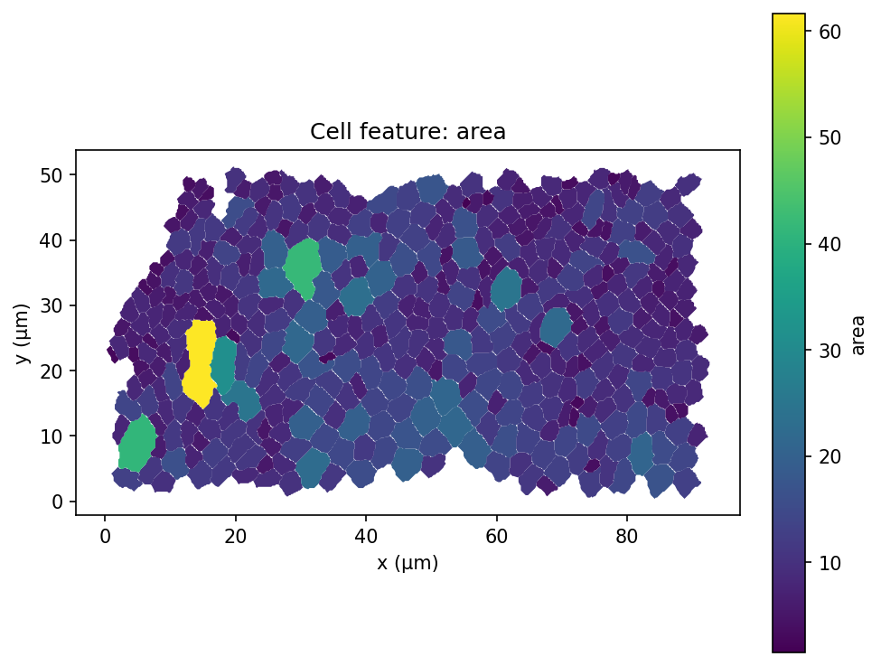
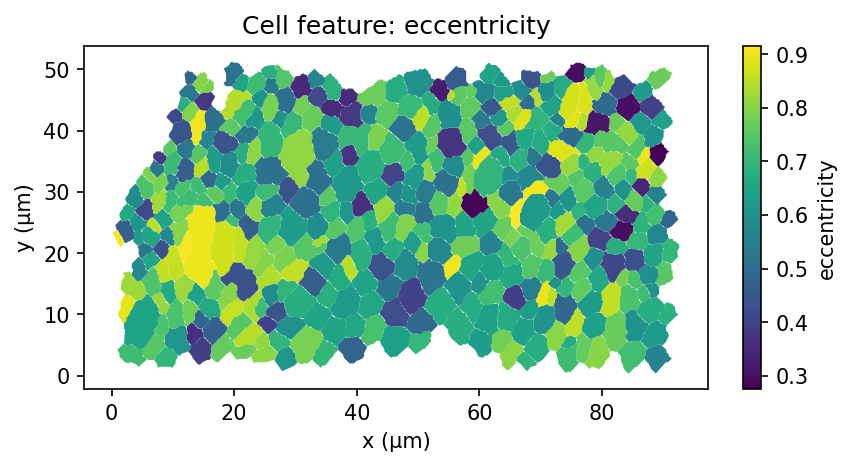
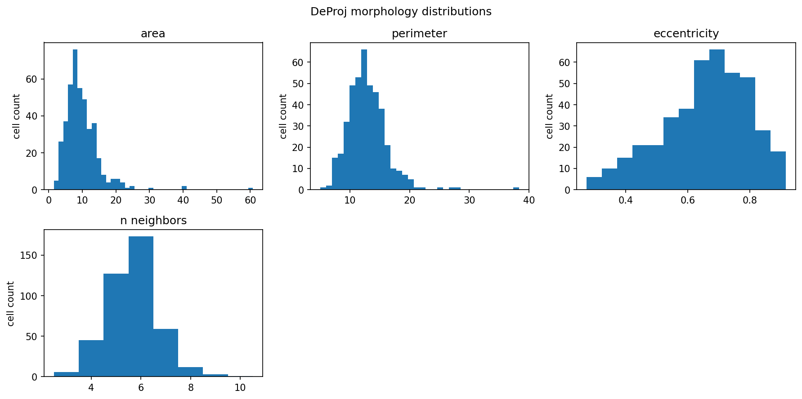
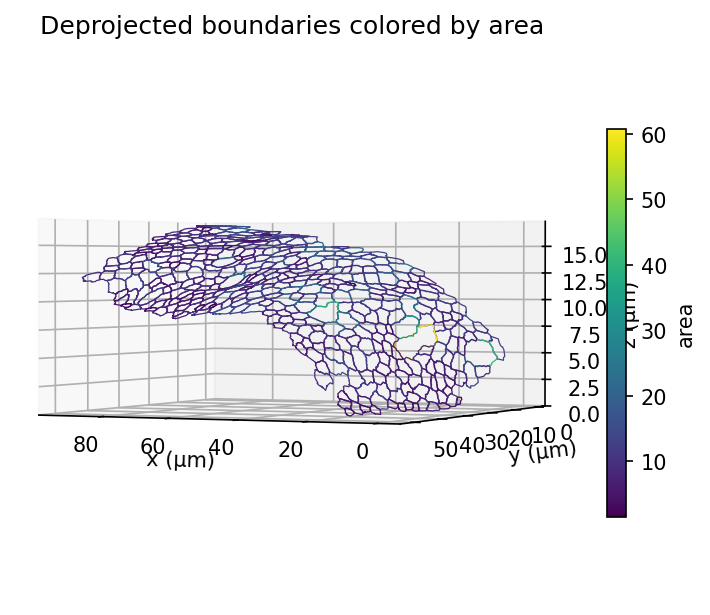
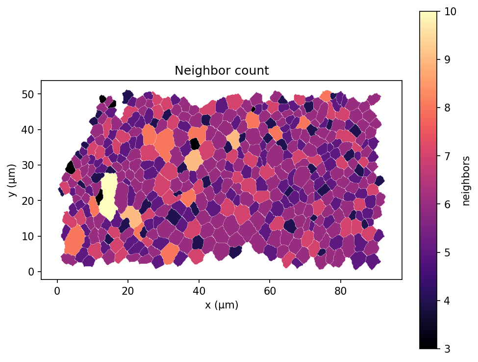
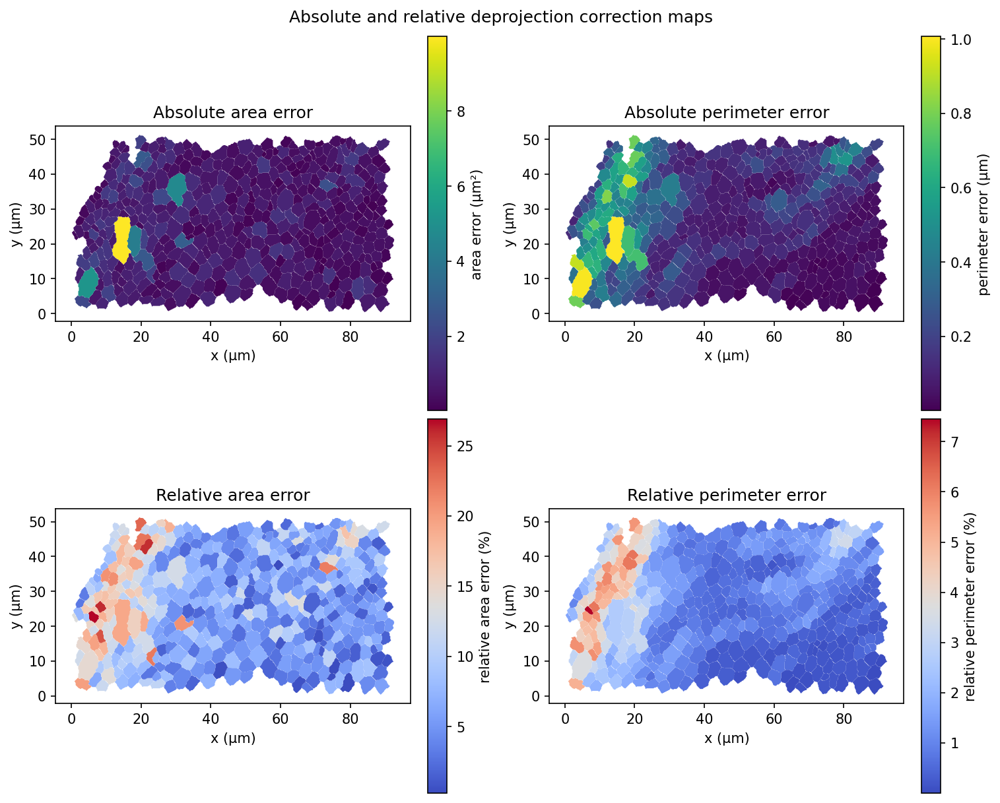
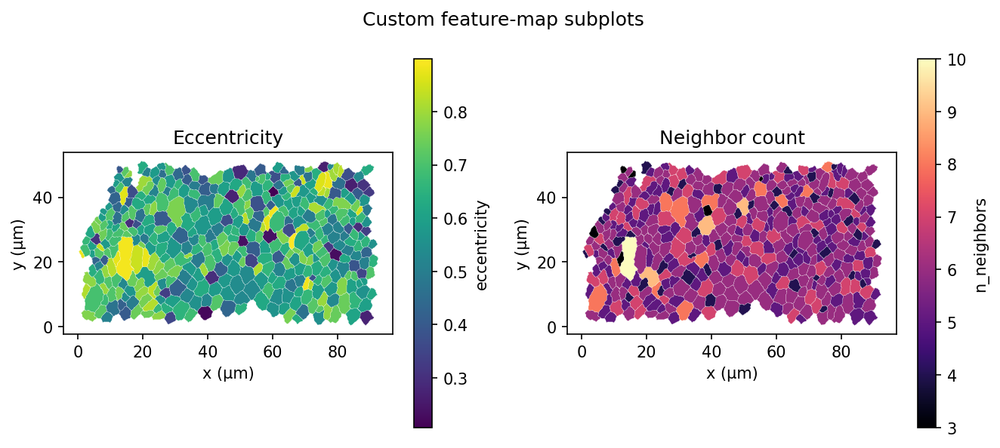

# deprojpy cookbook

Small, copy-pastable recipes for the current DeProj-style binary-mask and
height-map workflow. The image links below point to files
generated by `examples/02_plot_gallery.py`; run that script after cloning if the
images do not appear locally yet.

## Run the original DeProj sample

Use this when you want a quick end-to-end check that loading, deprojection, and
CSV export all work. The repository includes sample TIFFs under `samples/`.

```bash
python examples/01_run_sample.py
```

That script loads `samples/Segmentation-2.tif` and `samples/HeightMap-2.tif`,
prints a short summary, and writes:

```text
examples/output/results/measurements.csv
```

To use your own files, edit this block near the top of the script:

```python
MASK_PATH = SAMPLES_DIR / "Segmentation-2.tif"
HEIGHTMAP_PATH = SAMPLES_DIR / "HeightMap-2.tif"
OUTPUT_DIR = REPOSITORY / "examples" / "output"

PIXEL_SIZE = 0.183
VOXEL_DEPTH = 1.0
UNITS = "µm"
```

## Export measurements to CSV

Use this pattern inside scripts when you only need the measurements table. The
result dataframe contains one row per retained cell and stable morphology
columns such as area, perimeter, eccentricity, neighbor count, and correction
errors.

```python
import deprojpy as dp

mask, heightmap = dp.load_tiff_pair(
    "samples/Segmentation-2.tif",
    "samples/HeightMap-2.tif",
)
result = dp.from_heightmap(
    mask,
    heightmap,
    pixel_size=0.183,
    voxel_depth=1.0,
    units="µm",
    invert_z=True,
)
result.to_csv("examples/output/results/measurements.csv")
```

## Generate plot outputs

Use `save_plots(...)` for the standard visual summary bundle. It writes the
mask overlay, height map with centers, feature histograms, a 3-D boundary plot,
and one feature map per requested feature.

```python
import deprojpy as dp

mask, heightmap = dp.load_tiff_pair(
    "samples/Segmentation-2.tif",
    "samples/HeightMap-2.tif",
)
result = dp.from_heightmap(mask, heightmap, pixel_size=0.183, units="µm")
paths = dp.save_plots(
    "examples/output/plots",
    mask,
    heightmap,
    result,
    features=("area", "eccentricity"),
)
print(paths)
```

The gallery script creates these files. Edit its settings block if you want to
point at different images or write to a different output directory.

```bash
python examples/02_plot_gallery.py
```







## Using labeled segmentation images

Use this workflow when each pixel stores a cell ID instead of a binary ridge
mask. Install the sibling `labelimage-tools` package first. The loader can run
the label-image preprocessing pipeline, which fills gaps and removes small
disconnected label fragments so labels form touching cell regions.

```python
import deprojpy as dp

labels, heightmap = dp.load_label_heightmap_pair(
    "samples/Labels-2.tif",
    "samples/HeightMap-2.tif",
)
result = dp.from_labels(
    labels,
    heightmap,
    pixel_size=0.183,
    voxel_depth=1.0,
    units="µm",
    invert_z=True,
)
result.to_csv("examples/output/labeled_measurements.csv")
```

Original cell IDs are recoverable through the `source_label` column:

```python
df = result.to_dataframe()
print(df[["id", "source_label", "area", "perimeter"]].head())
```

Junctions are detected from 3×3 label neighborhoods. Their subpixel centroids
are used as graph nodes, cells are associated to junctions by label membership,
and the junction sequence is ordered along each label contour. Boundaries are
extracted as detailed label contours, then simplified in pixel coordinates
before height-map sampling with an internal 0.5 px tolerance.

```python
from deprojpy.plotting import plot_label_objects

fig, ax = plot_label_objects(labels, result)
fig.savefig("examples/output/labeled_plots/label_objects.png", dpi=150)
```

The script examples are:

```bash
python examples/03_run_labeled_sample.py
python examples/04_label_plots.py
```

## Estimate distances along the surface

Use surface distances when Euclidean distance through space is not the quantity
you want. The straight-line method lifts a straight `xy` segment onto the height
map and is fast enough for all-pairs matrices. The graph method builds a sparse
sampled surface graph and returns approximate geodesic shortest paths.

```python
import numpy as np

from deprojpy.surface_distance import (
    SurfaceDistanceCalculator,
    SurfaceGraph,
    cell_centers_xy_pixels,
)

calc = SurfaceDistanceCalculator.from_result(
    result,
    heightmap,
    prepared=False,
    invert_z=True,
)
centers = cell_centers_xy_pixels(result)

i, j = 10, 200
p0, p1 = centers[i], centers[j]

d_xy = np.linalg.norm((p1 - p0) * result.pixel_size)
d_straight = calc.straight_distance(p0, p1)

graph = SurfaceGraph.from_calculator(calc, step="auto", connectivity="16")
d_graph, path_xy = graph.distance(p0, p1, return_path=True)

subset = centers[:100]
D = calc.straight_pairwise_distances(subset)

print(f"2D xy distance:                 {d_xy:.3f} {calc.units}")
print(f"Straight-line surface distance: {d_straight:.3f} {calc.units}")
print(f"Graph-geodesic distance:        {d_graph:.3f} {calc.units}")
print(f"Pairwise matrix shape:          {D.shape}")
```

Run `python examples/05_surface_distances.py` for a complete script that also
plots the straight segment and graph shortest path.

## Color cells by a different feature

Feature maps are useful when you want to inspect spatial patterns rather than
only distributions. Any scalar `Epicell` field can be used, including
`area`, `perimeter`, `eccentricity`, `n_neighbors`, `area_error`, and
`perimeter_error`.

```python
from deprojpy.plotting import plot_feature_map

fig, ax = plot_feature_map(
    result,
    "n_neighbors",
    cmap="magma",
    edgecolor="white",
    linewidth=0.1,
    colorbar_label="neighbors",
)
fig.savefig("examples/output/plots/neighbor_map.png", dpi=150, bbox_inches="tight")
```



## Plot absolute and relative deprojection errors

Absolute errors show corrected-minus-projected area or perimeter in physical
units. Relative errors show the same correction normalized by the projected
measurement; this is often easier to compare across differently sized cells.

```python
import matplotlib.pyplot as plt
from deprojpy.plotting import plot_feature_map, plot_relative_error_map

fig, axes = plt.subplots(2, 2, figsize=(10, 8), layout="constrained")
plot_feature_map(result, "area_error", ax=axes[0, 0], title="Absolute area error")
plot_feature_map(result, "perimeter_error", ax=axes[0, 1], title="Absolute perimeter error")
plot_relative_error_map(result, "area", ax=axes[1, 0], title="Relative area error")
plot_relative_error_map(result, "perimeter", ax=axes[1, 1], title="Relative perimeter error")
fig.savefig("examples/output/plots/error_maps_2x2.png", dpi=150, bbox_inches="tight")
```



## Compose plots on your own matplotlib axes

All plotting helpers accept an optional matplotlib axis. That makes them easy
to combine with your own subplot layout, labels, titles, and saved figure
settings.

```python
import matplotlib.pyplot as plt
from deprojpy.plotting import plot_feature_map

fig, axes = plt.subplots(1, 2, figsize=(9, 4))
plot_feature_map(result, "eccentricity", ax=axes[0], title="Eccentricity")
plot_feature_map(result, "n_neighbors", ax=axes[1], title="Neighbor count", cmap="magma")
fig.tight_layout()
fig.savefig("examples/output/plots/custom_feature_maps.png", dpi=150, bbox_inches="tight")
```



## Set the 3-D view angle

The 3-D boundary plot returns the matplotlib 3-D axis, so you can choose a
camera angle before saving. The gallery uses a low elevation and oblique azimuth
to emphasize the tissue sheet.

```python
from deprojpy.plotting import plot_3d_boundaries

fig, ax = plot_3d_boundaries(result, "area")
ax.view_init(azim=115, elev=1)
fig.savefig("examples/output/plots/boundaries_3d.png", dpi=150, bbox_inches="tight")
```


## Check whether a run looks sane

These quick checks catch the most common input mixups: wrong files, shape
mismatches, unexpected retained-cell count, or failed metric computation.

```python
df = result.to_dataframe()
print(mask.shape)
print(len(result.epicells))
print(result.junction_graph.number_of_nodes())
print(df[["area", "perimeter", "eccentricity", "n_neighbors"]].describe())
print(df[["area", "perimeter"]].isna().sum())
```

For the bundled sample, expect image shape `(282, 508)`, 426 retained cells,
920 graph nodes, and finite positive cell areas and perimeters.

## Current validation status

This section is a reminder of the current confidence level. `deprojpy` is a
behavioral Python port of the MATLAB DeProj height-map workflow, with synthetic
geometry checks and bundled sample-image checks.

It is not yet certified against MATLAB golden-output tables.
